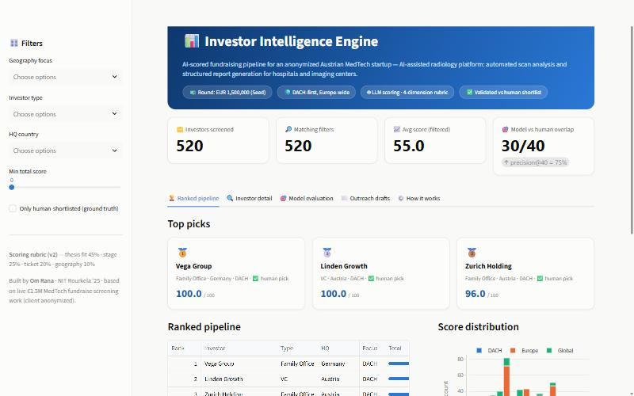
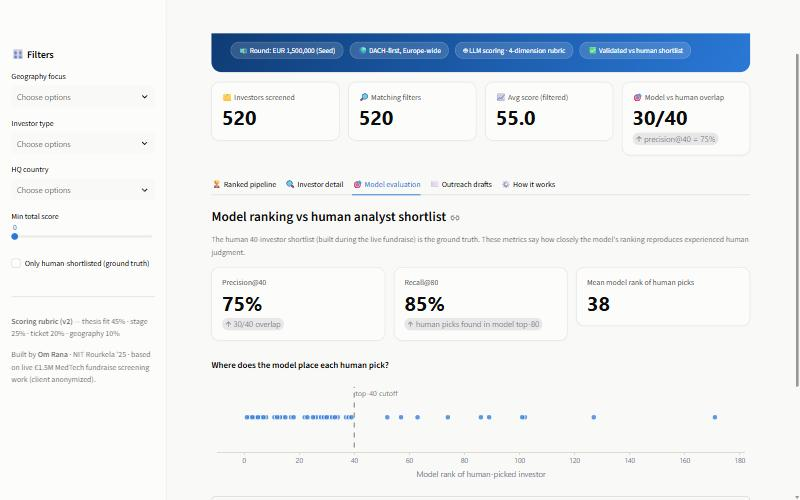

# 📊 Investor Intelligence Engine




An AI-powered investor-screening pipeline that automates what I previously did manually
during a live **€1.5M MedTech seed fundraise** (DACH/Europe): screen hundreds of VCs,
angels and family offices, rank them on thesis fit, and prepare personalized outreach.

Manual screening of ~200 investors took the better part of two weeks. This pipeline
screens **500+ investors in under 30 minutes**, and — critically — its output is
**validated against the human-built 40-investor shortlist** from the real fundraise.

## What it does

```
investors.csv (520 profiles)
        │
        ▼
┌─────────────────────┐     ┌──────────────────────┐
│  Scoring engine     │────▶│  Ranked pipeline      │
│  LLM (Claude) or    │     │  0–100 weighted score │
│  offline rubric     │     └──────────┬───────────┘
└─────────────────────┘                │
        weights (v2):                  ▼
        thesis 45%          ┌──────────────────────┐
        stage  25%          │ Evaluation vs human  │
        ticket 20%          │ 40-investor shortlist│
        geo    10%          │ precision@40, recall │
                            └──────────┬───────────┘
                                       ▼
                            ┌──────────────────────┐
                            │ Outreach generator   │
                            │ + Streamlit dashboard│
                            └──────────────────────┘
```

1. **Dataset** — 520 investor profiles (VCs, angels, family offices, CVCs) with thesis,
   stage focus, ticket size, geography and portfolio. Synthetic but modeled on the real
   screening universe of the fundraise (fictional names; the real tracker is confidential).
2. **Scoring engine** — each investor is scored 0–100 on a 4-dimension weighted rubric:
   thesis fit (45%), stage fit (25%), ticket fit (20%), geography fit (10%).
   Two modes: `--mode llm` uses an LLM (Gemini free tier or Claude) with structured
   JSON output; the default demo mode uses a deterministic offline rubric so the
   repo runs with no API key.
3. **Evaluation** — the model's top-40 is compared against a human analyst's
   40-investor shortlist (ground truth). The v1 rubric scored **68%** precision@40;
   disagreement analysis (which investors did the human pick that the model missed,
   and why) drove a v2 rubric — clinical-operations language now counts toward
   thesis fit, and weights shifted from 40/25/20/15 to 45/25/20/10 — lifting it to
   **precision@40 = 75%, recall@80 = 85%**.
4. **Outreach generator** — drafts a personalized intro email for each top investor,
   grounded in their actual thesis and portfolio (no invented facts).
5. **Dashboard** — Streamlit app with the ranked pipeline, per-investor score
   breakdowns, the model-vs-human evaluation view, and outreach drafts.



## Quickstart

```bash
pip install -r requirements.txt

python src/generate_dataset.py     # build the 520-investor universe
python src/make_shortlist.py       # build the human ground-truth shortlist
python src/scoring.py              # score all investors (offline demo mode)
python src/evaluate.py             # compare model top-40 vs human top-40
python src/outreach.py --top 20    # draft outreach emails
python src/tune_rubric.py          # (optional) re-run the rubric parameter sweep

streamlit run app.py               # open the dashboard
```

### Real LLM mode (free)

Get a free Gemini API key at https://aistudio.google.com/apikey (no card required):

```bash
set GEMINI_API_KEY=your-key                  # macOS/Linux: export GEMINI_API_KEY=...
python src/scoring.py --mode llm --limit 25  # quick test run
python src/scoring.py --mode llm             # full run (free tier, rate-limited ~35 min)
python src/outreach.py --top 20 --mode llm
python src/evaluate.py                       # re-evaluate against the human shortlist
```

Claude is also supported (`--provider claude` with `ANTHROPIC_API_KEY`); the scoring
prompt and rubric are provider-agnostic.

## Key learnings (the short version)

- **LLMs need rubrics, not vibes.** "Is this investor a fit?" gave inconsistent
  scores; four weighted, defined dimensions with strict JSON output made them reproducible.
- **Ground truth beats intuition.** Only the comparison against the human shortlist
  revealed where the model disagreed with an experienced screen — without it, the
  rankings would look plausible but be unverifiable. Disagreement analysis then
  drove the rubric from 68% to 75% agreement.
- **Hallucination is a data problem.** Grounding the prompt in the investor's actual
  thesis text (instead of relying on model memory) is what keeps outreach drafts factual.
- **Automate the screen, keep the judgment.** The pipeline compresses 2 weeks of
  screening into minutes, but the final shortlist call stays human.

## Project structure

```
├── app.py                  # Streamlit dashboard
├── data/
│   ├── investors.csv       # 520-investor universe
│   ├── manual_shortlist.csv# human ground truth (40 investors)
│   └── startup_profile.json# the (anonymized) startup being matched
├── src/
│   ├── generate_dataset.py
│   ├── make_shortlist.py
│   ├── scoring.py          # LLM / rubric scoring engine
│   ├── evaluate.py         # precision@40, recall@80 vs human picks
│   ├── tune_rubric.py      # parameter sweep that produced the v2 rubric
│   └── outreach.py         # personalized email drafts
└── output/                 # scored pipeline, eval report, drafts
```

---
*Built by Om Rana — NIT Rourkela '25. Based on investor-screening work for a live
European MedTech fundraise (client details anonymized).*
